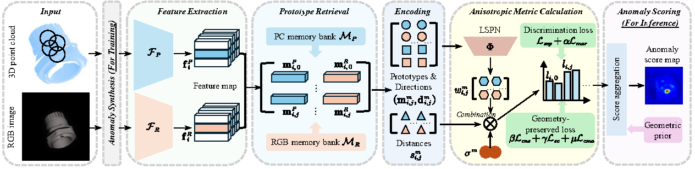
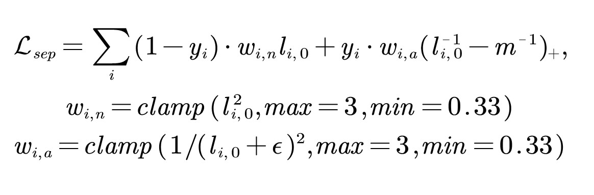

<!-- 顶栏徽章 -->
<p align="center">
  <!-- arXiv -->
  <a href="https://arxiv.org/abs/2503.10091">
    
  </a>
  <!-- License -->
  <a href="https://opensource.org/licenses/MIT">
    
  </a>
  <!-- Release（仅当仓库已发版才会显示数字） -->
  <a href="https://github.com/ctaoaa/G2SF/releases">
    
  </a>
  <!-- Issues（仅当仓库已有 open 的 issue 才会显示数字） -->
  <a href="https://github.com/ctaoaa/G2SF/issues">
    
  </a>
</p>

<p align="center">
  <a href="https://github.com/ctaoaa/G2SF/raw/main/framework.pdf">
    
  </a>
</p>


<h1 align="center">G$^2$SF: Geometry-Guided Score Fusion for Multimodal Industrial Anomaly Detection</h1>
<h3 align="center">ICCV 2025</h3>

<p align="center">
  <strong>Chengyu Tao<sup>1</sup>, Xuanming Cao<sup>2</sup>, Juan Du<sup>1,2</sup></strong>
</p>
<p align="center">
  <sup>1</sup>The Hong Kong University of Science and Technology &emsp; <sup>2</sup>The Hong Kong University of Science and Technology (Guangzhou)
</p>

<p align="center">
  📧 Corresponding: <a href="mailto:{{email}}">ctaoaa@connect.ust.hk</a>
</p>


<!-- 主图 -->
<p align="center">
  
</p>
---

### The training code for eyecandies dataset will be avaible within a few days!


## 🎯 Overview

This repository contains the official PyTorch implementation of our *G^2SF* accepted at *ICCV 2025*.

**Abstract**:  Industrial  quality inspection plays a critical role in modern manufacturing by identifying defective products during production. While single-modality approaches using either 3D point clouds or 2D RGB images suffer from information incompleteness, multimodal anomaly detection offers promise through the complementary fusion of crossmodal data. However, existing methods face challenges in effectively integrating unimodal results and improving discriminative power. To address these limitations, we first reinterpret memory bank-based anomaly scores in single modalities as isotropic Euclidean distances in local feature spaces. Dynamically evolving from Euclidean metrics, we propose a novel \underline{G}eometry-\underline{G}uided \underline{S}core \underline{F}usion (G$^{2}$SF) framework that progressively learns an anisotropic local distance metric as a unified score for the fusion task. Through a geometric encoding operator, a novel Local Scale Prediction Network (LSPN) is proposed to predict direction-aware scaling factors that characterize first-order local feature distributions, thereby enhancing discrimination between normal and anomalous patterns. Additionally, we develop specialized loss functions and score aggregation strategy from geometric priors to ensure both metric generalization and efficacy. Comprehensive evaluations on the MVTec-3D AD and Eyecandies datasets demonstrate the state-of-the-art detection performance of our method, and detailed ablation analysis validates each component's contribution.

**State-of-the-art performance**:
| Dataset   | I-AUROC  | P-AUROC  | AUPRO@30% | AUPRO@1% |
|-----------|----------|----------|---------- |----------|
|MVTec-3D AD|   97.1   |   99.7   |    97.9   |   46.8   |
|Eyecandies |   90.2   |   98.2   |    89.8   |   35.7   |

*Results from our official paper*

🖋️ If you find this code useful in your research, please cite:

<pre>
```bibtex
@inproceedings{tao2025g2sf,
  title={G2SF: Geometry-Guided Score Fusion for Multimodal Industrial Anomaly Detection},
  author={Tao, Chengyu and Cao, Xuanming and Du, Juan},
  booktitle={Proceedings of the IEEE/CVF International Conference on Computer Vision},
  pages={20551--20560},
  year={2025}
}
```
</pre>


## 🚀 Environment 

### Installation

```bash
# Clone the repository
git clone https://github.com/ctaoaa/G2SF.git
cd G2SF

# Create conda environment (recommended)
conda create -n G2SF python=3.9
conda activate G2SF
conda install pytorch==2.5.1 torchvision==0.20.1 torchaudio==2.5.1 pytorch-cuda=12.4 -c pytorch -c nvidia

# Install pointnet2-ops 0.3.0 (If any trouble, please go to the repo [Pointnet2_PyTorch](https://github.com/erikwijmans/Pointnet2_PyTorch/tree/master)
pip install pointnet2_ops_lib/. --no-build-isolation

# Install dependencies
pip install -r requirements.txt
```
## 🗄️ Datasets
1. Download the following two multimodal AD datasets ([MvTec3D-AD](https://www.mvtec.com/company/research/datasets/mvtec-3d-ad/downloads), [Eyecandies](https://eyecan-ai.github.io/eyecandies/download)).
2. Preprocess them with the scripts contained in *Preprocess* filefolder. Besides, you can directly download our preprocessed MvTec3D-AD [here](https://drive.google.com/file/d/1QaFiI5l4_PWE-enegdUgOGYYlTHWAQkT/view?usp=sharing).
3. Set your MvTec3D-AD and Eyecandies dataset paths in *config_parse.py*, respectively. Notably, we require the original MvTec3D-AD dataset during anomaly synthesis, i.e., *args.full_dataset_path* in Line 97 of *config_parse.py*.

## 📥 Checkpoints
1. Download the weights of RGB and point cloud feature extractors, i.e., [Dinov2](https://drive.google.com/file/d/14vQqN4Do1Vnx2TZVJ16LAW81FRq3o-UQ/view?usp=sharing) and [PointMAE](https://drive.google.com/file/d/14d04kH3bX2BbDEIJPI4MkRtolfQw_fds/view?usp=sharing). Moving them into *./G2SF_GITHUB/Checkpoints/* filefolder.
2. Download the weights of **G^2SF** [here](https://drive.google.com/file/d/1j_6RtoBK4U2GgYWVFx0r6lBU0Coxzbnu/view?usp=sharing). Unzipping and moving them into *./G2SF_GITHUB/Results/* filefolder. **DO NOT CHANGE THE STRUCTURES OF SUBFOLDERS**.
3. Please check the following organization structure:
-
   Checkpoint/
               
  ├── dino_vitbase8_pretrain.pth
  
  ├── pointmae_pretrain.pth   

-
  Result/
  
  ├── mvtec/Complete/Classes

  ├── eyecandies/Complete/Classes


## 🚀 Inference G^2SF
```bash
# G^2SF requires the construction of memory banks during the initial run; this takes a few minutes per class, following the approach of M3DM [Wang et al., CVPR 2023](https://github.com/nomewang/M3DM).
python3 main.py --load_feature False --load_fusion_dataset True --load_fuser True --dataset mvtec (or eyecandies)

# For subsequent runs, you can simply execute:
python3 main.py --load_feature True --load_fusion_dataset True --load_fuser True --dataset mvtec (or eyecandies)
```
## 🚀 Train G^2SF

*Due to a hardware failure that forced us to rebuild the Python environment, the tuning parameters differ slightly from those reported in our original paper. In addition, we add a weighted form of separation loss (Eq. (4)) for stable training, as follows:*

<!-- Separation loss -->
<p align="left">
  
</p>

We obtain a better AUPRO@1% 47.1 for MvTec3D-AD dataset. The retrained model weights can be found [here](https://drive.google.com/file/d/1rfnq2sncNONWsvohxjWcFKBi_BSDAieg/view?usp=sharing).


```bash
# You need to create anomaly sources from normal data across the whole dataset
cd ./G2SF_GITHUB/Dataset
python3 create_anomaly_source.py --dataset mvtec (or eyecandies)

# Train G^2SF as follows:
cd ./G2SF_GITHUB
python3 main.py --load_feature False --load_fusion_dataset False --load_fuser False --dataset mvtec
```

## 🙏 Acknowledgements
We would like to extend our sincere appreciation to the authors of the following projects for making their code available, including [M3DM](https://github.com/nomewang/M3DM) and [CFM](https://github.com/CVLAB-Unibo/crossmodal-feature-mapping/tree/main).


